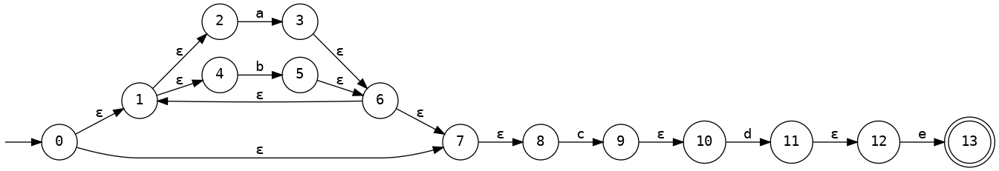

# rex

Rex is a command-line utility for visualising and testing simple regular expressions. It takes regular expressions as text input. It has two subcommands, `dot` and `test`

## `rex dot <phase> <regex>`

`rex dot` takes a simple regular expression as text input, and outputs various abstract representations of the regex at different phases of compilation. The output format is the GraphViz `dot` language, which can be visualised with the `dot(1)` utility.

### Output formats: 

- `rex dot tokens <regex>`: Outputs the regular expression as a stream of tokens.
- `rex dot ast <regex>`: Outputs the regular expression as an abstract syntax tree.
- `rex dot nfa <regex>`: Outputs the regular expression as an NFA (Non-deterministic finite automaton).
- `rex dot dfa <regex>`: Outputs the regular expression as a DFA (Deterministic finite automaton).

### Examples:

- `rex dot tokens '(a|b)*cde' | dot -Tpng > tokens_example.png`: 
  

- `rex dot ast '(a|b)*cde' | dot -Tpng > ast_example.png`: 
  

- `rex dot nfa '(a|b)*cde' | dot -Tpng > nfa_example.png`: 
  

- `rex dot dfa '(a|b)*cde' | dot -Tpng > dfa_example.png`: 
  

## `rex test <regex> <test-string>`

`rex test` takes a simple regular expression and a test string to evaluate against the regex. It will print `true` if the test string matches the regular expression and `false` if it does not. 

### Examples:

- `rex test '(a|b)*cde' abababcde`
  ```
  true
  ```

- `rex test '(a|b)*cde' ohno`
  ```
  false
  ```

If you add the `--dfa` flag when testing an expression, it will be compiled to a DFA before testing, which has different performance characteristics.
