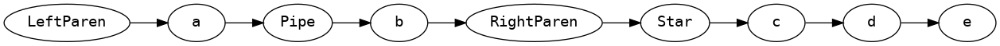
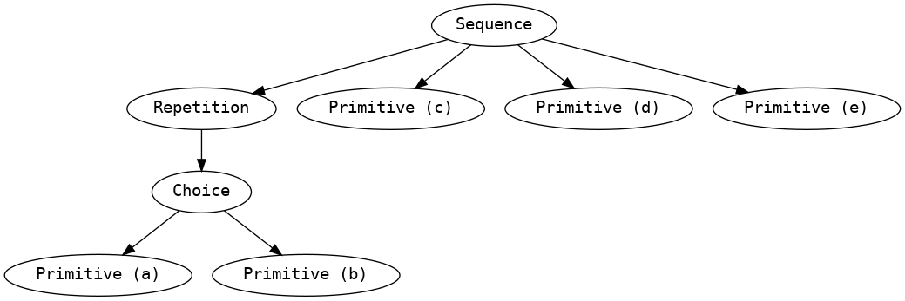

# rxp

Rxp (Regex eXPlorer) is a command-line utility for visualising and testing simple regular expressions. It takes regular expressions as text input. It has two subcommands, `dot` and `test`

## `rxp dot <phase> <regex>`

`rxp dot` takes a simple regular expression as text input, and outputs various abstract representations of the regex at different phases of compilation. The output format is the [GraphViz](https://graphviz.org/) `dot` language, which can be visualised with the [`dot(1)` utility](https://graphviz.org/download/).

### Output formats: 

- `rxp dot tokens <regex>`: Outputs the regular expression as a stream of tokens.
- `rxp dot ast <regex>`: Outputs the regular expression as an abstract syntax tree.
- `rxp dot nfa <regex>`: Outputs the regular expression as an NFA (Non-deterministic finite automaton).
- `rxp dot dfa <regex>`: Outputs the regular expression as a DFA (Deterministic finite automaton).

### Examples:

- `rxp dot tokens '(a|b)*cde' | dot -Tpng > tokens_example.png`: 
  

- `rxp dot ast '(a|b)*cde' | dot -Tpng > ast_example.png`: 
  

- `rxp dot nfa '(a|b)*cde' | dot -Tpng > nfa_example.png`: 
  
  Arrows marked `ε` are [epsilon transitions](https://en.wikipedia.org/wiki/Epsilon_transition), or transitions which the automaton can make without consuming any input. Arrows marked with any other unicode grapheme cluster are transitions which the automaton can make by consuming a single element of its input. This might get confusing if your test string is in Greek. Sorry!

- `rxp dot dfa '(a|b)*cde' | dot -Tpng > dfa_example.png`: 
  

## `rxp test <regex> <test-string>`

`rxp test` takes a simple regular expression and a test string to evaluate against the regex. It will print `true` if the test string matches the regular expression and `false` if it does not. 

### Examples:

- `rxp test '(a|b)*cde' abababcde`
  ```
  true
  ```

- `rxp test '(a|b)*cde' ohno`
  ```
  false
  ```

If you add the `--dfa` flag when testing an expression, it will be compiled to a DFA before testing, which has different performance characteristics.
